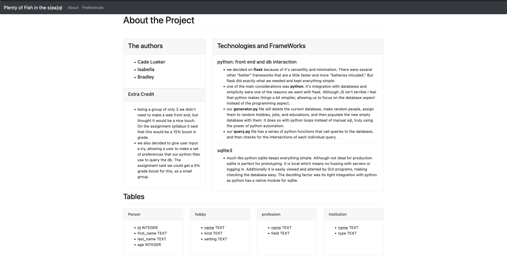

# dataBasesFinal
Final Project CSDS341

- Trying to decide between python and flask or js and svelte for a simple "dating website" where users set preferences and based on commonalities they are matched.
- need a simple web front end
- need a simple cli 
- leaning towards python as it is a bit more streamlined in terms of interacting with a db 

# Information and screen shots 

- everything relating to the outcome of the project can be found in the 
- 
